# Project 4 - Sharebnb

**GA SEI Project 4: Full Stack Python & Django Application**

You can find a hosted version of our app here :  [Sharebnb](https://shareb-n-b.herokuapp.com/) (deployed using Heroku)

To access all available features, please sign up for an account or use the following details:

email: elsieadmin@email.com
password: adminPassword156

## Overview

This was my fourth and final project on General Assembly’s Software Engineering Immersive course.  Given the choice to either work individually or in a group, I chose to work in a pair - keen to further my pair-programming skills as well as widen the scope of work that I could achieve within the week timeframe.

We were given just over a week to build a full-stack application, using a Python Django API and Django REST Framework to serve data from a PostgreSQL database whilst consuming this API with a separate front-end, built with React. 

Our idea was Sharebnb.  Taking inspiration from the outrageous and luxurious properties presented on TV series such as Selling Sunset, whilst combining this with the concept and styling behind websites suchas Airbnb -  Sharebnb is a platform where users can swap houses with other users. Users can advertise their house for swapping, as well as explore and make requests on other houses, add properties to their favourites, and leave reviews on properties they have stayed in.

This Readme will outline the approach we took and the wins and challenges that I encountered along the way.

## Collaborators

* Hugo Kinahan - [Github](https://github.com/hugokinahan)
## Brief

* **Build a full-stack application** by making your own backend and your own front-end
* **Use a Python Django API** using Django REST Framework to serve your data from a Postgres database
* **Consume your API with a separate front-end** built with React
* **Be a complete product* which most likely means multiple relationships and CRUD functionality for at least a couple of models
* **Implement thoughtful user stories/wireframes** that are significant enough to help you know which features are core MVP and which you can cut
* **Have a visually impressive design** to kick your portfolio up a notch and have something to wow future clients & employers. **ALLOW** time for this.
* **Be deployed online** so it’s publicly accessible.

## Timeframe and Technologies Used

**Timeframe**: 1 week in a pair


**Back-End**:
* Python 
* Django
* Django REST Framework

**Database**:
* PostgreSQL

**Front-End**:
* React.js
* JavaScript (ES6)
* HTML5 
* Semantic UI React Framework
* Yarn
* Axios
* CSS5 and SASS
* Cloudinary
* Dependencies installed: Mapbox, react-router-dom, react-popup

**Dev Tools**:
* Git & GitHub
* Insomnia
* Trello
* VSCode & Eslint
* Heroku 

## Features

* Landing Page
* Sign up page and login page
* Index of all properties (list or map view)
* Filter properties by City, Continent or Country
* Detail view for each Property
* Login & Logout with restricted visibility for logged in users
  * Create, edit and delete property
  * Send requests to other users to swap their property
  * Ability to leave reviews, add to favourites
  * Ability to follow other users
  * User profile - with panel to manage requests as well as created. Properties
  * View the other user profile

## The Site:

<!-- Login page:
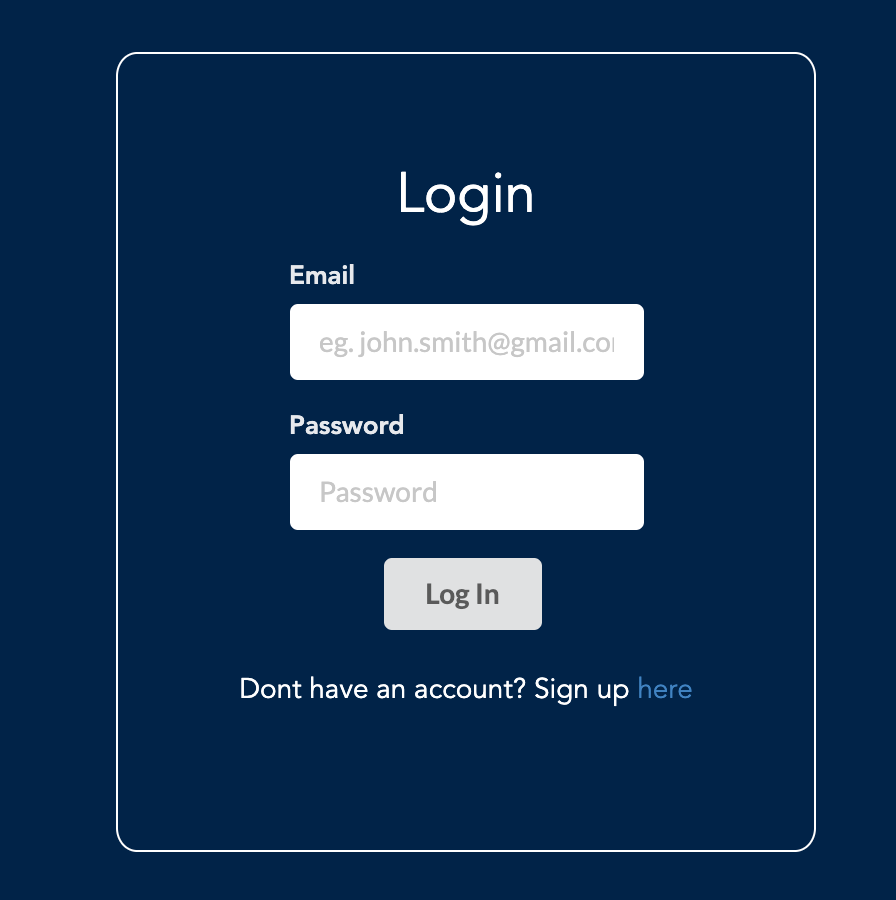
Sign up and register your property pages:
Select relevant property types when registering your property:
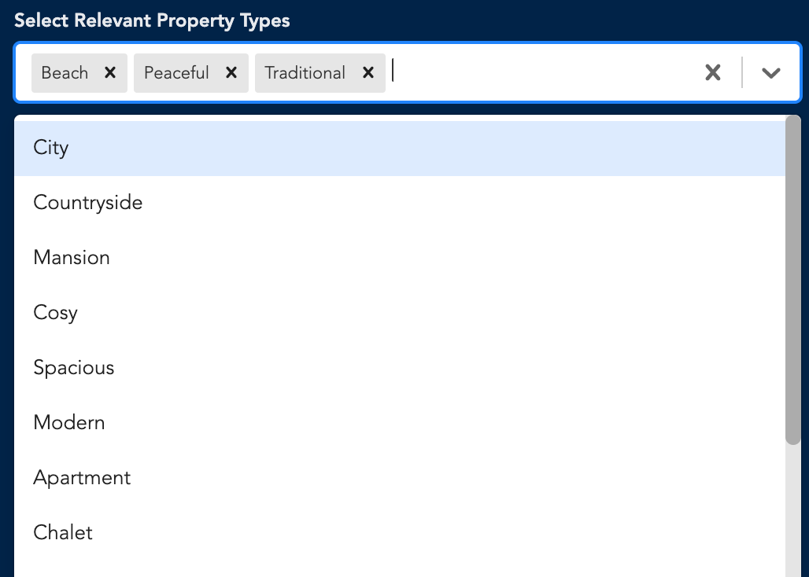 -->
Homepage:
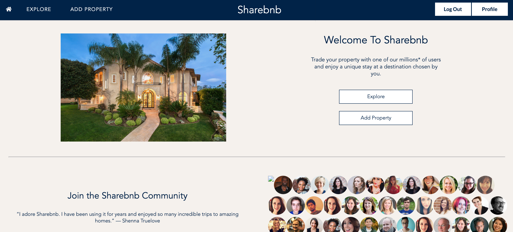
<!-- Featured properties:
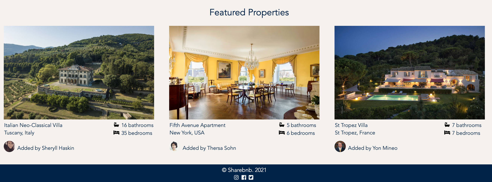 -->
Explore Properties - Index of all properties with recently added properties:
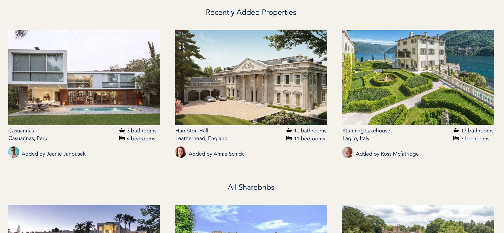
Search for properties (by City, Country or Continent):
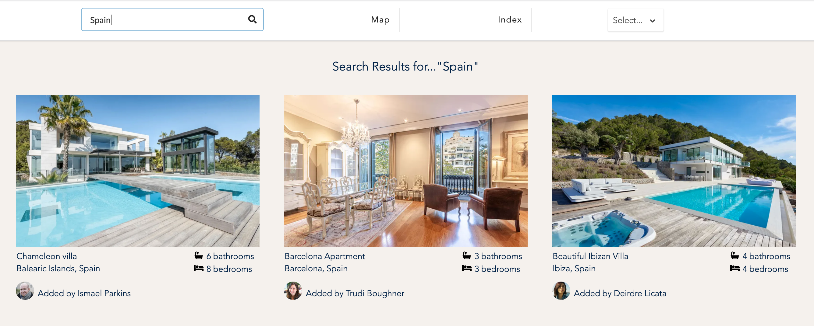
Find properties on map view:
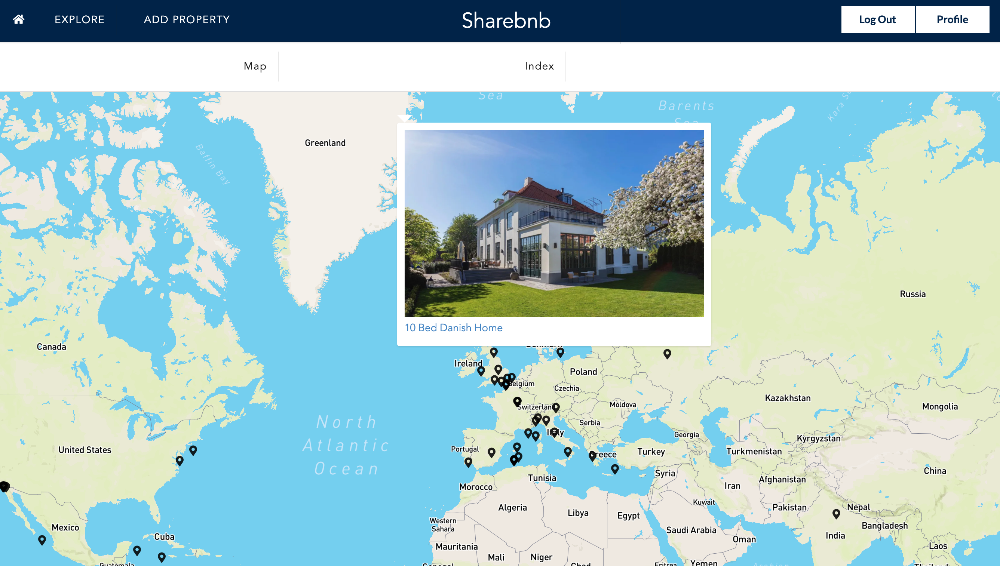
Detail page for each property:
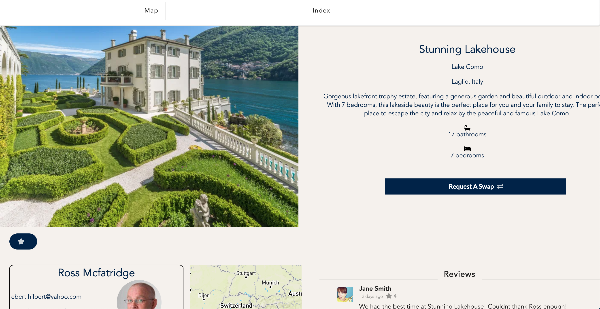
Send a property request: 
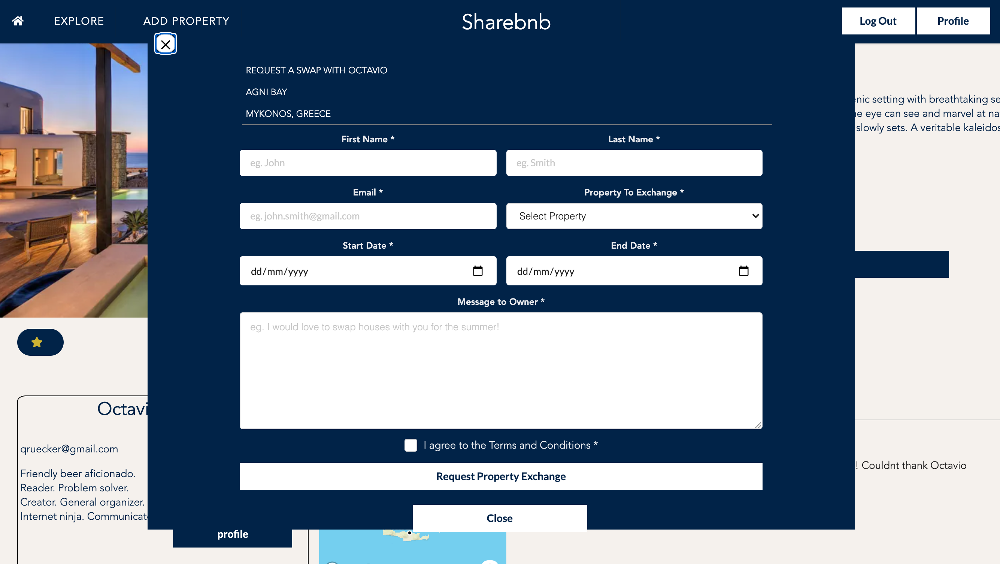
Profile page: 
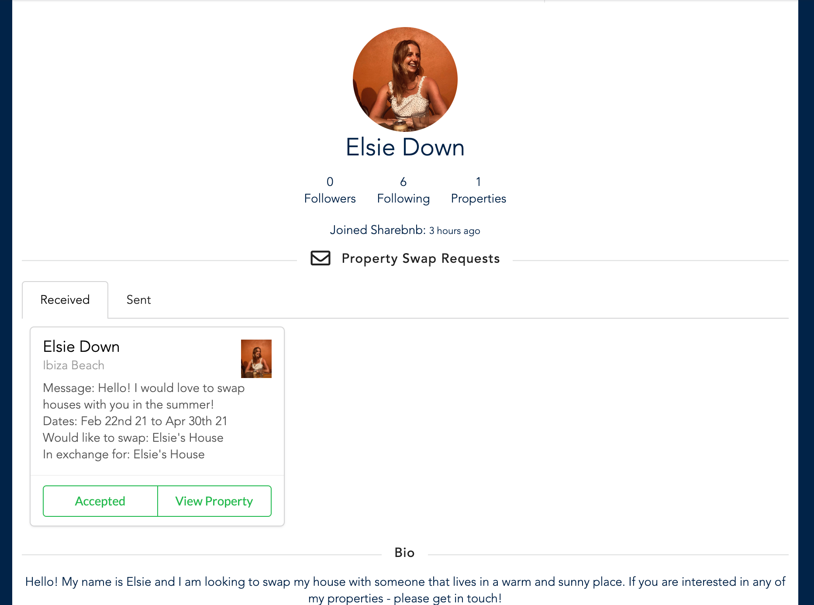
Manage properties (both owned and favourited):
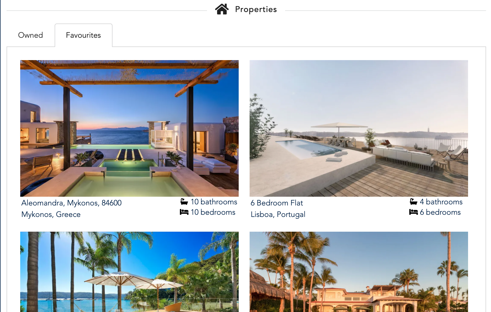
<!--  -->

Manage property swap requests (both sent and recieved) :
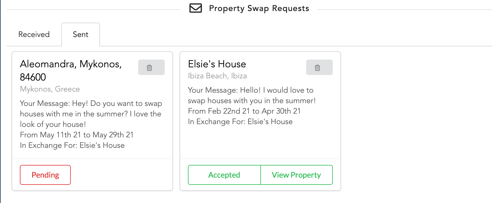

<!-- Modal pop-up alerts:
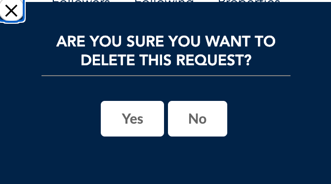 -->


## Approach Taken

**Planning**

* Having learnt the importance of thorough planning in previous projects, we spent the first 24 hours coming up with a concrete plan for our project - confirming how we wanted the site to look and what functionality we wanted to build. 
* Having both used Trello in Project 3, we used this as our main focal point of keeping track of tasks that we needed to carry out and dividing up the work. 

* We came up with detailed wireframes as well as an ERD Diagram so that we were both clear on what entities we were going to include within our database and the relationships between those entities. This really helped when it came to building our models in the back-end.


**Development**

**Back-End**


* Knowing that our project was relatively ambitious, and keen to devote enough time to working on the front-end, we decided to pair-code the back-end as we believed this would be the most efficient use of our time and we also both wanted to cement our understanding of how to set up a Django & Python based API. We took turns coding, whilst the other oversaw the process - this worked relatively well and we had finished most of the back-end by Day 3. 
* We started the development of the back-end by creating our models for all the different entities - properties, property types, offers, reviews and users. As we made the models, we established the relationships between the different entities - including one-to-one and many-to-many relationships as displayed below:

```
from django.db import models
from django.core.validators import MinValueValidator, MaxValueValidator

class Review(models.Model):
    text = models.TextField(max_length=300)
    created_at = models.DateTimeField(auto_now_add=True)
    rating = models.IntegerField(validators=[MinValueValidator(1), MaxValueValidator(5)])
    property = models.ForeignKey(
        "properties.Property",
        related_name="reviews",
        on_delete=models.CASCADE
    )
    owner = models.ForeignKey(
        "jwt_auth.User",
        related_name="posted_reviews",
        on_delete=models.CASCADE
    )

    def __str__(self):
        return f"Review - {self.id} on Property - {self.property}"


```

* We built out the serialisers for each model as we went, before moving onto setting up REST Framework - and the different get, put, post, delete requests for each entity.  We also worked don user authentication to limit certain requests to logged-in users and owners of certain properties / reviews:

```
class PropertyListView(APIView):

    permission_classes = (IsAuthenticatedOrReadOnly, )

    def get(self, _request):
        properties = Property.objects.all() #querying property from index
        serialized_property = PopulatedPropertySerializer(properties, many=True) #expect a list
        return Response(serialized_property.data, status=status.HTTP_200_OK)

    def post(self, request):
        request.data['owner'] = request.user.id
        property_to_create = PropertySerializer(data=request.data)
        if property_to_create.is_valid():
            property_to_create.save()
            return Response(property_to_create.data, status=status.HTTP_201_CREATED)
        return Response(property_to_create.errors, status=status.HTTP_422_UNPROCESSABLE_ENTITY)

```

* As we had done in project 3, we spent the first few nights putting together a thorough seed database to populate our site with lots of properties and users. 


**Front-End**


## Challenges

* A main challenge for me was getting my head around the user of serializers in the back-end and using these in a way so that I had the correct output in the front-end.  Whilst I was setting up the ‘house swap requests’ in the front-end I kept coming across instances where I was not receiving the correct data in the requests (eg. The details of the owner of the request were not displaying). I then had to go back to the back-end and alter the serialisers, adding in nested serialisers in a few cases. In future, I would clearly think out what data would be attached to each model and what serialisers were necessary so that the correct information would be returned and to avoid having to alter the back-end later down the line.

```
from rest_framework import serializers
from ..models import Property


class PropertySerializer(serializers.ModelSerializer):

  
    class Meta:
        model = Property
        fields = '__all__'

class NestedPropertySerializer(serializers.ModelSerializer):
    class Meta:
        model = Property
        fields = ('id', 'name', 'property_image', 'city', 'country', 'owner')

```


## Wins
* Considering we had only been learning Python and Django for just a week, I was impressed with the fact that we were able to build a full-stack app which was based in Python and Django. Overall, we were really happy with the amount of functionality that we achieved and how our site looked.
* I was happy with how I carried forward my understanding of how relationships were established from my previous projects, and adapted this knowledge for the Python and Django back-end. I was pretty happy with how the 'house swap requests' worked both in the back-end and front-end.

## What I learned
* As this was my first project using Python and Django, I learned a huge amount. It was interesting to translate my knowledge and understanding of JavaScript and put into practice everything we had learned over the duration of the course in general.
* It was a great chance to further my pair-programming skills and I loved working a pair. I took what I had learned from the previous group projects (both failures and successes) and applied those learnings to ths project, which I believe resulted in a relatively smooth and successful project.

## Future Features

* If we had more time, we would have liked to work more on our styling - making the website fully responsive to both smaller screens and mobiles. I would also have liked to add more animations, something I learned about in my previous projects from my team-mates but would be keen to implement myself.
* I would also have liked to add the functionality where users are notified about new requests (or accepted requests) - eg. adding a notification feature on the navbar.
* At the current moment, the error messages are also quite generic for our forms so I would like to build these up to a point where they are more specific and inform the user what the exact error is.
